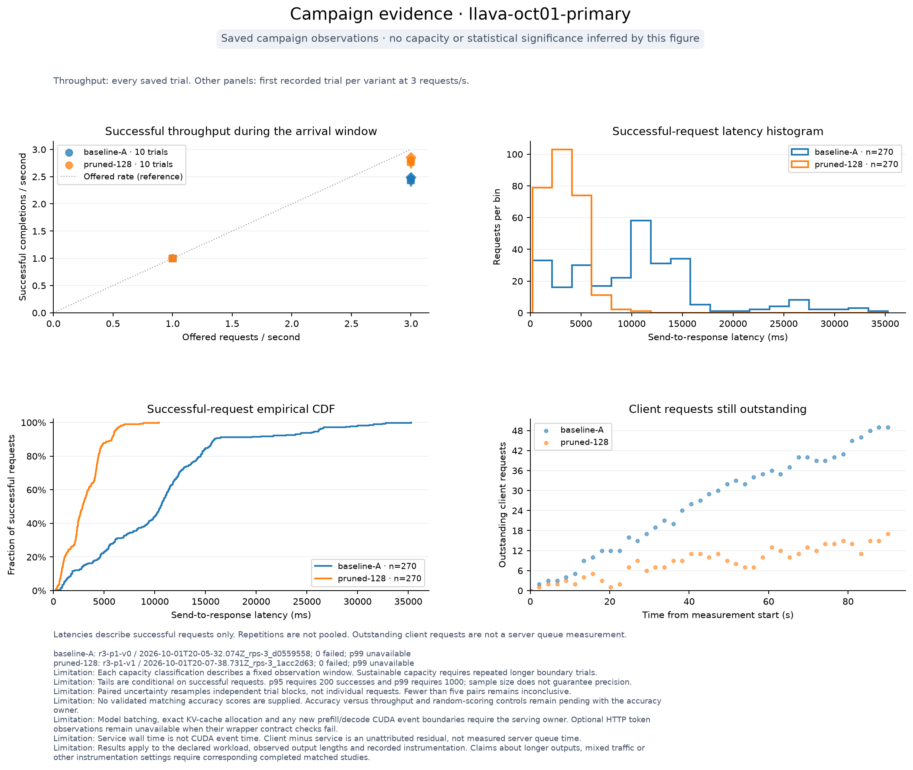

# October 1 A40 measurement results

The completed primary study supports a modest measured serving benefit from changing the existing configuration from 576 to 128 visual tokens: **13.95% more successful completions within the 90-second arrival window at 3 requests/second**. At 1 request/second, paired p50 HTTP latency fell **9.95%**. These results concern the recorded, instrumented, batch-one serving path and the existing 90-question dev workload. They do not establish unchanged accuracy or a maximum sustainable request rate.

All seven saved campaigns are complete: **58 trials, 8,820 measured requests and 580 warmups, with zero request failures**. The [completion table](../MEASUREMENT_STATUS.md) links each study; the [collection index](../../results/provenance/2026-10-01/collection-index.json) verifies the saved reports and raw artifacts against the PostgreSQL verification records. The fixed budgets were preserved, including inconclusive findings.

## Primary comparison

The [fixed protocol](OCT01_PROTOCOL.md) prescribed five adjacent paired trials at each of 1 and 3 RPS. Each trial replayed 270 measured requests after ten completed warmups and settling. The rate-block order was randomized and paired leg order alternated. All **5,400 measured requests and 200 warmups** completed without request failure. Raw hashes, timing relationships, workload replay, configuration and summaries passed the canonical reader. [PostgreSQL verification](../../results/campaigns/2026-10-01/llava-oct01-primary/report/storage-verification.json) matched the file evidence; a second import added no records.

| Comparison | Median paired effect | 95% paired-block bootstrap interval | Interpretation |
|---|---:|---:|---|
| 3 RPS: successful completions within the fixed window (primary outcome) | +13.95% | +13.70% to +14.73% | Improvement under these measured conditions |
| 1 RPS: p50 HTTP latency | 9.95% lower | 8.40% to 12.06% lower | Lower latency at light load |
| 3 RPS: p50 HTTP latency | 59.29% lower | 48.16% to 72.99% lower | Lower latency in this overloaded window, not a steady-state tail |
| 1 RPS: successful completions within the window | 0.00% | 0.00% to 0.00% | Both variants completed the offered 1 RPS; capacity equivalence is not established |

Intervals resample the five whole paired blocks, using 10,000 seeded draws. Requests inside a trial are not independent experimental replications. Five blocks provide limited uncertainty resolution, and the secondary latency outcomes do not replace the predeclared primary outcome. The effect is the median of paired percentage changes, not a percentage computed from pooled requests or independently aggregated trial medians.

At 3 RPS the baseline completed 2.389–2.489 requests/second within the window and retained 46–55 outstanding requests at its end. The 128-token variant completed 2.722–2.856 requests/second and retained 13–25 outstanding requests. All eventually completed, after 19.26–22.06 seconds of additional drain for the baseline and 5.36–7.90 seconds for the pruned variant. Waiting after arrivals stop is real work and is not evidence of sustainable capacity.

Both variants passed every 1-RPS finite-window screen. The baseline failed every 3-RPS screen; the pruned variant produced mixed screen outcomes, so its capacity bracket remains inconclusive. The screening tolerance does not turn its nonzero outstanding work into proof that 3 RPS is sustainable. Neither variant has an exact capacity ceiling or a measured server-queue boundary.

Each primary trial has 270 successes, making its p95 eligible under the project policy. GPU p99 remains unavailable. The [full report](../../results/campaigns/2026-10-01/llava-oct01-primary/report/report.md) retains every trial's p50/p95, failures, drain and capacity reasons; percentiles are not pooled across trials.

The throughput panel shows every saved trial. Other panels deliberately show only the first recorded pair at 3 RPS, with its run IDs; they are illustrative distributions, not the paired inference itself.

## Isolated HTTP comparison

The [isolated campaign](../../results/campaigns/2026-10-01/llava-oct01-isolated/report/report.md) completed five paired blocks, **900 measured requests and 100 warmups**, without failure. Each request included the full HTTP boundary and completed before the next began. There is no offered arrival rate; the saved rate parameter is only a campaign placeholder.

Keeping 128 tokens reduced paired p50 HTTP latency by **13.48%** (95% paired-block bootstrap interval **10.32% to 16.94%**) and increased serial completion rate by **13.75%** (**12.44% to 16.47%**). Baseline trial p50 values ranged from 467.98 to 479.36 ms; pruned values ranged from 398.15 to 419.70 ms. Each trial has 90 measured observations, so p95/p99 remain unavailable.

The isolated p50 effect, low-load p50 effect and overloaded-window p50 effect are different outcomes. The much larger latency reduction in the 3-RPS windows accompanies less outstanding client work, but these experiments do not directly measure server queue time or establish which GPU stage causes the change. They use different arrival processes and per-trial budgets, and no separate interaction test comparing their effect sizes was performed. Serial completion rate is not maximum serving capacity.

## Incremental HTTP observation overhead

The [matched off/on campaign](../../results/campaigns/2026-10-01/llava-oct01-http-overhead/report/report.md) completed five isolated pairs, **900 measured requests and 100 warmups**, without failure. Both legs used 576 visual tokens and the same clean `e90148c` source; only extended HTTP observations changed.

Defining signed latency overhead as `(on − off) / off`, the paired p50 estimate was **−0.45%**, with a 95% paired-block bootstrap interval of **−3.56% to +0.84%**. The interval crosses zero: this fixed-budget test is **inconclusive**, not proof that observation is free or that the two modes are equivalent. Serial completion-rate change was also inconclusive: **+0.21%**, interval **−1.23% to +2.77%**. No additional trials were added to force a conclusion.

All 450 measured enabled-mode requests supplied valid token-contract and stage observations. Each enabled trial had a median of ten generated nonspecial text tokens, a range of 1–52, and natural EOS on every request; no enabled request reached the 64-step budget. The measured observation stage's per-trial p50 ranged from **0.079 to 0.089 ms**. That narrow stage excludes other costs introduced by returning metrics; the full-HTTP paired comparison is the overhead check. These counts describe the enabled follow-up and do not backfill the original primary records.

The test leaves existing model-internal CUDA events, synchronization and diagnostic writes active in both legs. It does not estimate their total cost. Host-wall stage medians are not additive and do not isolate GPU prefill/decode.

## Prompt-policy observations

The [long-instruction policy](../../results/campaigns/2026-10-01/llava-oct01-workload-long/report/report.md) completed four trials: **360 measured requests and 40 warmups**, without failure. The appended three-sentence instruction did **not** produce long answers. Every trial's median was **one generated nonspecial text token** (range 1–17), or two generated steps including EOS (range 2–18). All 360 measured responses ended naturally; none reached the 64-step budget. Prompt text did get longer: each trial's formatted prompt-text median was 92 tokens, with range 82–99.

Both variants completed every prescribed 1-RPS arrival within the observation window. The descriptive paired p50-latency reduction was 12.44%, but two paired blocks cannot resolve uncertainty under the frozen policy; no confidence interval, p95, p99 or capacity claim is made. These results describe a longer instruction and unexpectedly short generated answers. They do not isolate the effect of long generated output. The fixed protocol was preserved rather than retuning the prompt after observing its responses.

The [mixed policy](../../results/campaigns/2026-10-01/llava-oct01-workload-mixed/report/report.md), with 45 original questions and 45 appended instructions, also completed **360 measured requests and 40 warmups** without failure. Both baseline trials had a text-token median of one (range 1–52); both pruned trials had a median of two (range 1–64). Each pruned trial had one response reach the 64-step budget without EOS, while all baseline responses ended naturally. The descriptive paired p50 reduction was 8.16%; the two-pair comparison remains inconclusive. Changed response lengths and termination prevent interpreting the latency difference as a pure compute reduction at fixed output length. The report retains the one pruned-trial request that finished after the arrival window.

The final [original-question policy](../../results/campaigns/2026-10-01/llava-oct01-workload-short/report/report.md) completed **360 measured requests and 40 warmups** without failure. All four trials had a median of ten generated text tokens. Each pruned trial had one response reach the budget without EOS. The descriptive paired p50 reduction was 7.06%, again inconclusive with two blocks. One request in the second pruned trial completed 1.09 seconds after the window ended. The original-question baseline generated longer answers than the appended-instruction policy, underscoring why the policy names cannot substitute for observed output lengths.

Every trial below has 90/90 valid observations. Entries show **min / p50 / max within each trial**; the two repetitions of each listed condition have identical characterizations, and are not pooled. Steps include EOS/special tokens. EOS and cap counts are per trial, with no EOS-at-budget cases. Each raw report retains the trial and run IDs.

| Policy / visual tokens | Prompt text tokens | Generated text tokens | Generated steps | Output characters | EOS / cap without EOS |
|---|---:|---:|---:|---:|---:|
| Long instruction / 576 | 82 / 92 / 99 | 1 / 1 / 17 | 2 / 2 / 18 | 2 / 3 / 63 | 90 / 0 |
| Long instruction / 128 | 82 / 92 / 99 | 1 / 1 / 17 | 2 / 2 / 18 | 3 / 3 / 63 | 90 / 0 |
| Mixed / 576 | 50 / 64 / 99 | 1 / 1 / 52 | 2 / 2 / 53 | 2 / 3 / 199 | 90 / 0 |
| Mixed / 128 | 50 / 64 / 99 | 1 / 2 / 64 | 2 / 3 / 64 | 2 / 4 / 273 | 89 / 1 |
| Original question / 576 | 47 / 57 / 64 | 1 / 10 / 52 | 2 / 11 / 53 | 2 / 36 / 199 | 90 / 0 |
| Original question / 128 | 47 / 57 / 64 | 1 / 10 / 64 | 2 / 11 / 64 | 2 / 38 / 273 | 89 / 1 |

These policy studies use only one offered rate and two paired blocks each. They characterize this dev workload; they do not establish a workload-by-pruning interaction, sustained capacity or output-quality equivalence. Observed differences in response length remain part of the natural-EOS result.

## Baseline and measurement checks

Before the primary comparison, [six identical 576-token pilot trials](../../results/campaigns/2026-10-01/llava-baseline-pilot/report/report.md) completed 540 measured requests plus 60 warmups without failure. Trial p50 ranged from 515.57 to 558.52 ms: an 8.21% relative range and 0.61% relative median absolute deviation. Those are descriptive observed variations, not a promised detection threshold. The pilot's 90 observations per trial cannot support the project's p95/p99 claims. The [final pilot verification](../../results/campaigns/2026-10-01/llava-baseline-pilot/report/storage-verification-final.json) validates the current report against raw evidence and PostgreSQL; its earlier verification record is retained as history.

The separate [synthetic coordinated-omission demonstration](../../results/calibration/2026-10-01/coordinated-omission-fixed-10000/report.md) preserves 40,000 measured requests. At the 750-RPS target, open loop sent all 10,000 prescribed arrivals within the 13.333-second reference window and observed 9,768.202-ms p95 latency. The completion-paced control sent only 4,442 in that window and showed 3.359-ms p95; it eventually sent all 10,000 over 29.907 seconds. These are CPU-service observations illustrating a client-design failure, not GPU benchmark results.

The [CUDA diagnostic](../../results/calibration/2026-10-01/2026-10-01T19-48-34Z_5c1e8d96/calibration.json) records warmup, CUDA-event and host-enqueue observations separately. Its cache-perturbation comparison did not establish the expected slowdown. It does not measure the model's prefill/decode split or validate model-instrumentation overhead.

## Readiness wait outside request timing

Each attempt preserves `startupMs` in its exported `server.json`. In the [runner](src/campaign.ts), this clock starts after process launch and resource-monitor initialization, immediately before waiting for verified health, and includes readiness polling. It is not a complete process-launch interval or pure model-loading duration. These waits, warmups and settling are outside measured HTTP latency. The following nearest-rank p50 values describe all saved attempts, across both variants; no timing comparison is inferred.

| Study | Attempts | Readiness-wait p50 (seconds) | Min–max (seconds) |
|---|---:|---:|---:|
| Baseline pilot | 6 | 9.49 | 9.30–42.30 |
| Primary | 20 | 9.72 | 9.10–51.09 |
| Isolated HTTP | 10 | 9.51 | 9.09–42.52 |
| HTTP observation overhead | 10 | 9.71 | 9.11–9.92 |
| Long instruction | 4 | 9.30 | 9.14–9.30 |
| Mixed | 4 | 9.31 | 9.30–9.91 |
| Original question | 4 | 9.32 | 8.90–10.17 |

## Scope and provenance

The primary and isolated studies use clean source `356df7d66f7cf4c7524c93d7c9d373e2b920fbfc`; the [observation follow-up](OCT01_OBSERVATION_PROTOCOL.md) uses clean source `e90148c647c62eb8dbc1a856f5cd96e44bd6f202`. They must not be pooled as if source and instrumentation were identical. Reports retain server/client revisions, GPU UUID/driver/runtime, effective configuration, request-order seeds and exact artifact hashes. Load trials overlap requests at the client; the server retains its blocking generation path. Continuous batching is outside this study.

The main LLaVA checkpoint is revision `4481d270cc22fd5c4d1bb5df129622006ccd9234`, with downloaded file hashes verified before use. A container-image digest was unavailable. The exact CLIP revision was not captured by the original health endpoint; [supplemental cache inspection](../../results/provenance/2026-10-01/vision-cache-provenance.json) after the primary study found candidate `ce19dc912ca5cd21c8a653c79e251e808ccabcd1`, but cannot retrospectively prove the loaded revision. [Static source inspection](../../results/provenance/2026-10-01/frozen-model-source-provenance.json) preserves both launchers' import paths and source hashes; it is not introspection of the earlier running processes. These gaps remain explicit.

GPU resource files sample the whole device, including startup, approximately once per second; sampled used memory is not exact KV-cache allocation or a guaranteed transient peak. CPU-load collection was implemented after these frozen execution revisions, so the current GPU evidence has no CPU-load observations. Those missing values have not been backfilled.

The [preserved model diagnostic archive](../../results/provenance/2026-10-01/supplemental-model-diagnostics/provenance.json) contains 9,400 nonempty records, with verified raw/compressed hashes and decompression. It mixes campaigns and lacks canonical request correlation, so it is supplemental evidence of the existing instrumentation, not a source for reportable GPU-stage comparisons. [Final session checks](../../results/provenance/2026-10-01/supplemental-model-diagnostics/final-session-verification.json) record clean frozen source checkouts, closed owned endpoints and no remaining owned model/campaign or GPU compute processes. The shared pod stays running.

The configured visual-token budget decreased by 77.78%, but that is not a measurement of total FLOP reduction, actual primary-run sequence lengths, or wall-time reduction. The primary revision did not record actual output lengths. Existing model-internal CUDA events, synchronization and diagnostic writes were active; the later HTTP off/on test isolates only its additional observations. No causal prefill/decode decomposition or direct comparison to a paper's different timing boundary is established here.

Matching validated accuracy remains pending. [The saved pending handoff](../../results/campaigns/2026-10-01/llava-oct01-primary/accuracy-handoff/accuracy-throughput.json) lists the two required execution identities and creates no fabricated accuracy points. Sribhav supplies the locked split, validated scorer, per-category results and random-control evidence. Amay supplies serving correctness, responsive queue admission, batching/padding and exact GPU/KV metrics. Their implementations are outside this measurement change.
