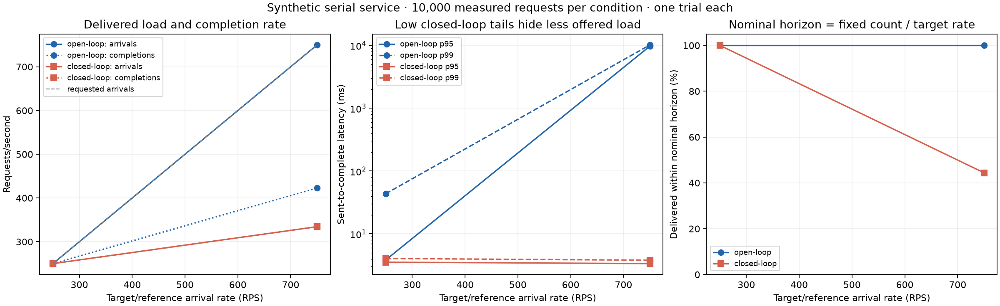
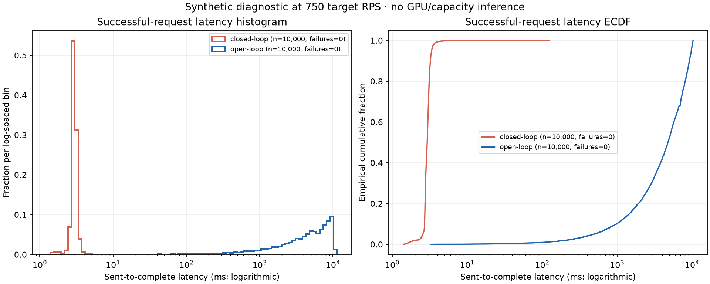

# Synthetic coordinated-omission demonstration

CPU-only serial-service diagnostic. These observations do not establish model/GPU speed, production capacity, accuracy, or a statistically resolved optimization.

The saved protocol fixed 10,000 measured requests and ten warmups per condition, target rates 250, 750 RPS, requested service timer 2 ms, and seed 465 before collection. Each condition ran once in the saved shuffled order.

Open loop uses the canonical TypeScript load generator. The explicit closed-loop control awaits every response. Both preserve the reference schedule; closed-loop lateness exposes arrivals delayed before dispatch. Its actual observation window is recorded separately from the nominal count/rate horizon.

| Mode | Target RPS | Actual arrivals RPS | Completion RPS incl. drain | Success / budget | Failures | Reference horizon s | Actual elapsed s | Delivered in reference horizon | p50 ms | p95 ms | p99 ms |
|---|---:|---:|---:|---:|---:|---:|---:|---:|---:|---:|---:|
| closed-loop | 250 | 249.998 | 250.004 | 10000 / 10000 | 0 | 40.000 | 39.999 | 10000 / 10000 | 3.043 | 3.539 | 4.049 |
| open-loop | 250 | 250.000 | 250.000 | 10000 / 10000 | 0 | 40.000 | 40.001 | 10000 / 10000 | 3.108 | 3.849 | 43.683 |
| closed-loop | 750 | 334.375 | 334.375 | 10000 / 10000 | 0 | 13.333 | 29.907 | 4442 / 10000 | 2.930 | 3.359 | 3.806 |
| open-loop | 750 | 749.941 | 422.805 | 10000 / 10000 | 0 | 13.333 | 23.652 | 10000 / 10000 | 4772.814 | 9768.202 | 10209.803 |

The plots show sent-to-complete latency conditional on success. Nearest-rank p95 requires 200 successes and p99 requires 1,000; small smoke tests retain unavailable tails. This diagnostic keeps the full distribution and never treats 10,000 correlated requests as 10,000 independent trial replications. No confidence interval or significance claim is made.

Requested timer delay is not an exact service duration; actual server queue/service intervals are in each raw response. Each service is a separate process on the same host. Connection scheduling and CPU contention remain part of the observed system.

`protocol.json` was saved before collection. `demo.json` links each portable trial directory, raw SHA-256 and counts. The plotting verifier checked hashes, budgets, outcomes, closed-loop nonoverlap, reference-horizon counts and raw nearest-rank tails before rendering. Exact source snapshots are under `source/`.
